# Rapport de TP 1 : Initiation à Git et GitHub
**Étudiant :** Rayan El Ghazi  SMI 0272/23
**Dépôt :** TP1-ElGhaziRayan

---

## 1. Création et initialisation de mon premier dépôt
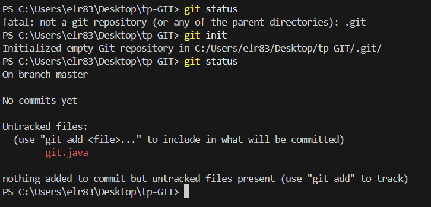

---
## 2.Suivre un fichier 
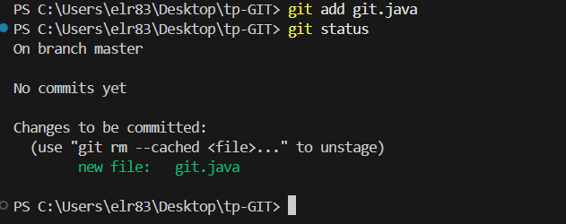
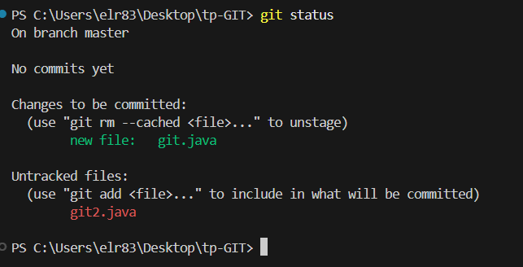

---

## 3.Passer mon premier commit 
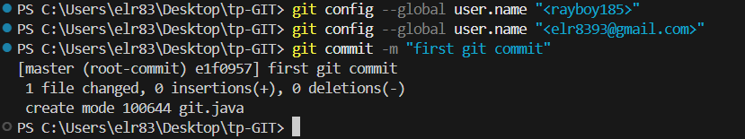
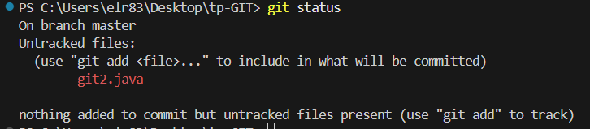

je remarque que le premier fichier a disparu de git status car il a
été commité, mais le deuxième fichier apparaît toujours comme
'untracked'. Git m'informe qu'il y a des fichiers non suivis dans le dossier

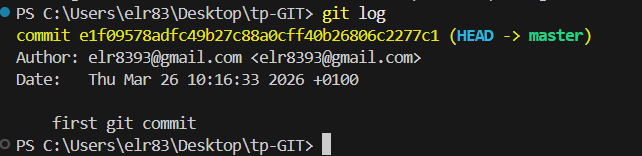
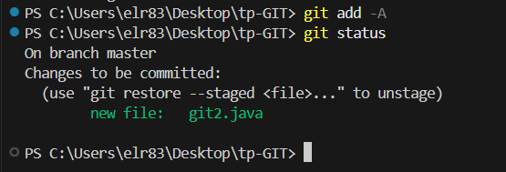
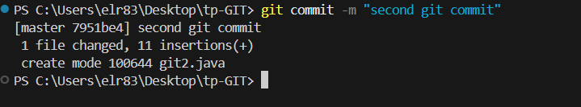
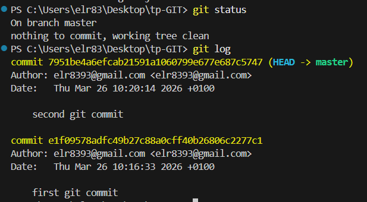
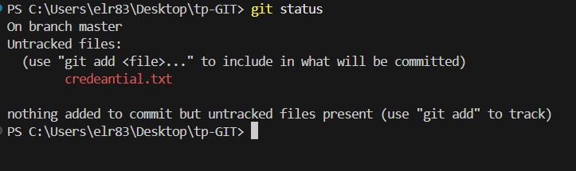
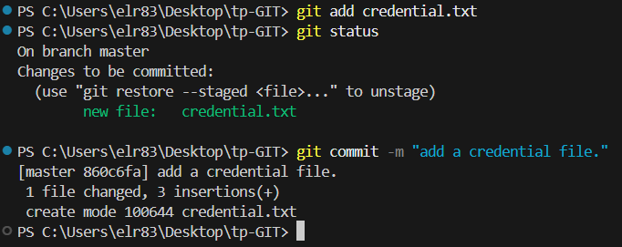
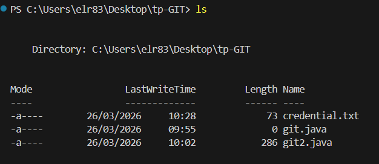
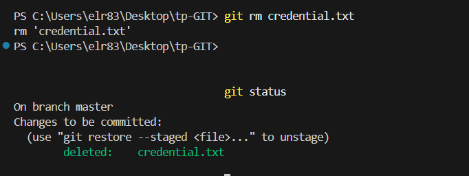

## 4.Ignorer un fichier

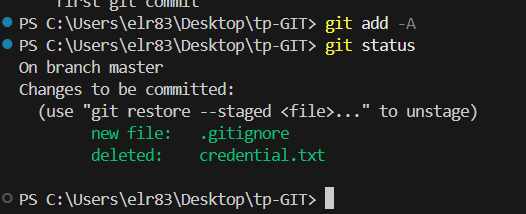
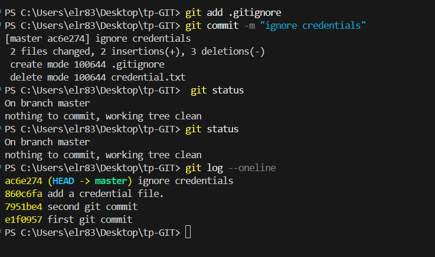

Après avoir recréé le fichier credentials, la commande “git
status” affiche 'nothing to commit, working tree clean'. Le fichier
credentials n'apparaît pas car il est correctement ignoré par le fichier
.gitignore. Cela signifie que Git ne suivra plus jamais ce fichier

---

## 5.Pousser votre code vers un dépôt distant

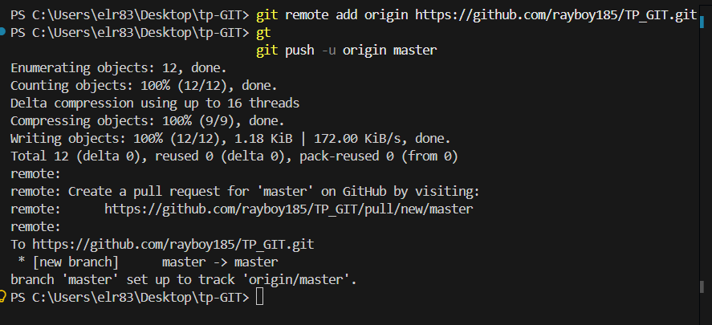

---
*Rapport finalisé par RAYAN EL GHAZI SMI0272/23.*
